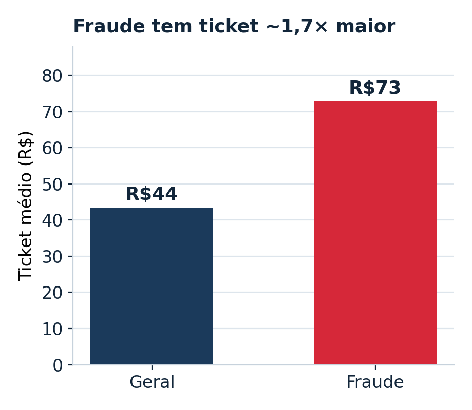
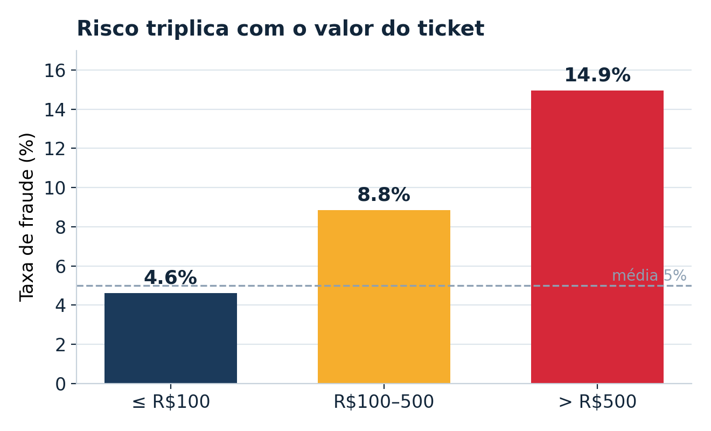
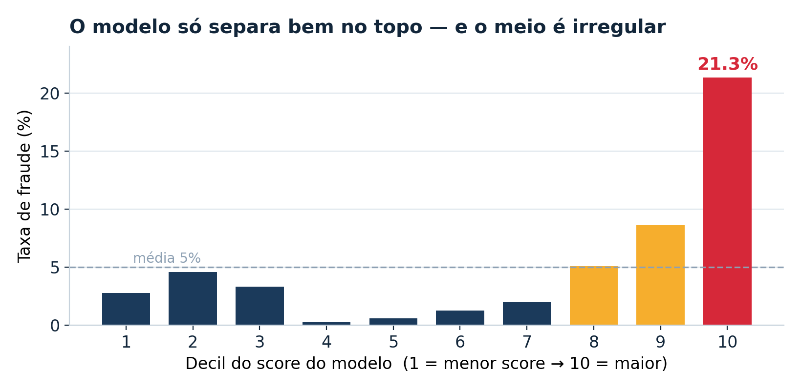
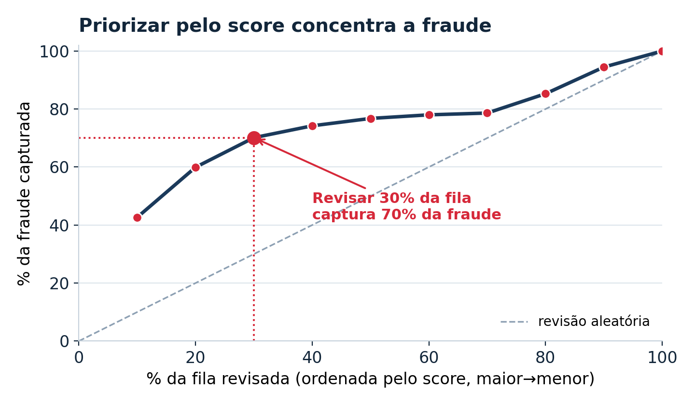
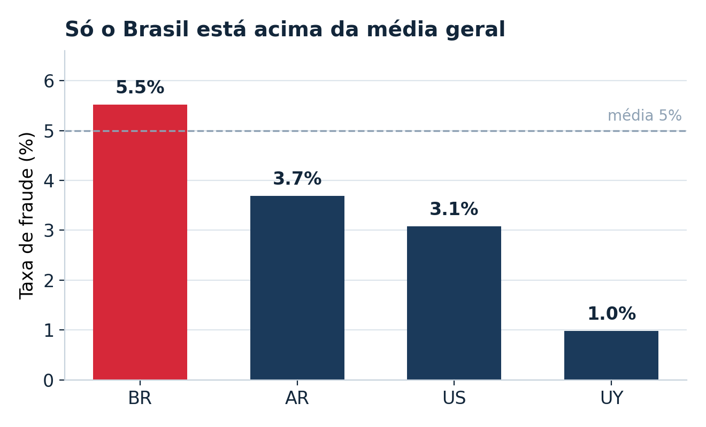

# Detecção de Fraude em Transações

**Relatório de análise — fatores de risco, desempenho do modelo atual e recomendações priorizadas**

> Base analisada: 150.000 transações · grão de 1 linha por transação · rótulo de fraude (0/1).
> Métrica central: taxa de fraude = média da coluna `fraude`. Prevalência global de 5,0% (classe rara).

---

## 1. Sumário executivo

A fraude nesta base é rara (5,0%), mas não é aleatória: concentra-se de forma previsível em dois eixos — o **valor da transação** e o **topo do score do modelo**. Isso abre uma oportunidade direta de operação: priorizar a revisão por esses eixos ataca a maior parte da perda com o menor esforço. Os cinco achados centrais:

| Achado | Leitura |
|---|---|
| **Valor é o sinal mais forte** | Compras acima de R$ 500 têm 14,9% de fraude — mais de 3× a média. É o segmento de maior perda por transação. |
| **Risco ≠ dinheiro** | A faixa acima de R$ 500 tem a maior *taxa*, mas a maior *exposição em reais* está na faixa intermediária (R$ 100–500): ~43% de todo o valor exposto. |
| **O modelo só separa no topo** | O decil de maior score tem 21,3% de fraude (~4× a média), mas a faixa intermediária não ordena risco de forma confiável. |
| **70% da fraude em 30% da fila** | Ordenando pelo score, revisar os 30% de maior risco captura 70% de todas as fraudes; o decil mais alto sozinho concentra 43%. |
| **Risco concentrado no Brasil** | O Brasil é o único país acima da média (5,5%) e responde por 74% do volume; o Uruguai quase não registra fraude (1,0%). |

**Recomendação central:** montar uma fila de revisão priorizada pelo score do modelo, com regra dura de revisão para tickets altos, e priorizar um ciclo de recalibração do modelo — direcionado à faixa de valor R$ 100–500 (onde mora a maior exposição financeira) e aos decis intermediários de score (onde o modelo hoje ordena mal).

---

## 2. Contexto e método

O objetivo é entender onde a fraude se concentra e avaliar se o modelo de score já existente é útil na operação. A análise parte da tabela de modelagem `abt_fraude` (150.000 transações, uma linha por transação), construída a partir da junção das tabelas de compra e dos três blocos de score, com remoção de 200 registros de teste.

Como a fraude é uma classe rara (5,0%), a análise se apoia em **taxa de fraude** (a média da coluna `fraude`), e não em contagem absoluta — que favoreceria apenas os segmentos maiores. Ao comparar grupos, aplica-se um piso mínimo de volume para evitar conclusões sobre amostras pequenas demais. A exceção deliberada é a análise por faixa de valor, em que taxa de fraude e **valor absoluto em reais** são reportados lado a lado: sem isso, não se enxerga que "onde está o risco" e "onde está o dinheiro" não coincidem. Todas as queries estão no arquivo [`sql/queries_analiticas.sql`](../sql/queries_analiticas.sql) que acompanha este relatório.

> **Nota de qualidade de dados.** A segmentação por faixa de valor usa `CASE` com `ELSE` para a faixa mais alta; como `NULL < 500` não é verdadeiro em SQL, eventuais `valor_compra` nulos caem na faixa "acima de R$ 500". Recomenda-se checar `COUNT(*) WHERE valor_compra IS NULL` e isolar nulos numa faixa própria antes de reportar essa fatia como uma tese fechada.

---

## 3. Panorama do problema

| 150.000 | 7.500 | 5,0% | R$ 547 mil |
|:---:|:---:|:---:|:---:|
| transações | fraudes | taxa de fraude | valor exposto |

Das 150 mil transações, 7.500 são fraudes — os 5,0% que servem de linha de base para todo o resto. O valor financeiro diretamente exposto em transações fraudulentas soma R$ 547 mil. Vale notar que o ticket médio de uma fraude (R$ 73) é cerca de 1,7× o ticket médio geral (R$ 44): a fraude tende a buscar transações de maior valor — o que já antecipa o primeiro achado.

---

## 4. O valor da transação: sinal forte, leitura nuançada

*Taxa de fraude por faixa de valor da compra.*

O risco cresce de forma limpa e acentuada com o tamanho do ticket: de 4,6% nas compras até R$ 100 para 8,8% na faixa intermediária e 14,9% acima de R$ 500 — mais que o triplo da média. Embora o segmento acima de R$ 500 seja pequeno em volume (1.037 transações), sua taxa de fraude o torna o mais crítico por transação e um candidato natural a revisão obrigatória.

### Onde está o risco não é onde está o dinheiro

Olhar só a taxa é enganoso quando o objetivo é priorizar mitigação por real evitado. Cruzando a taxa com a exposição financeira de cada faixa, o cenário muda de forma importante:

| Faixa de valor | % dos casos de fraude | % do valor exposto | Valor exposto | Perda média / fraude |
|---|---:|---:|---:|---:|
| até R$ 100 | ~84% | ~31% | R$ 170 mil | ~R$ 27 |
| R$ 100–500 | ~14% | ~43% | R$ 233 mil | ~R$ 226 |
| acima de R$ 500 | ~2% | ~26% | R$ 144 mil | ~R$ 931 |

> Percentuais de casos reconstruídos a partir das taxas de fraude arredondadas — servem para dimensionar a divergência entre casos e exposição, não como número contábil exato.
>
> **Ressalva.** Como `NULL < 500` não é verdadeiro em SQL, eventuais `valor_compra` nulos caem na faixa "acima de R$ 500" — os números dessa faixa podem estar levemente contaminados. Diagnóstico completo dos nulos é a primeira checagem sugerida antes de fechar decisão sobre essa faixa (ver Seção 2).

Três leituras práticas saem dessa tabela:

- **Faixa acima de R$ 500 — revisão obrigatória.** Maior taxa (14,9%) e maior perda por caso (~R$ 931), com volume pequeno (~1.037 transações). Custo operacional de revisão baixo, retorno alto. É a regra dura mais natural do sistema.
- **Faixa R$ 100–500 — onde o modelo tem a maior alavancagem.** Concentra ~43% de todo o valor exposto, mas o volume é grande demais para revisar tudo na mão. É o segmento em que investir em score/modelo mais reduz perda em reais — e é justamente onde o score hoje ordena mal (ver seção 5).
- **Faixa até R$ 100 — automação e uma pergunta em aberto.** 84% dos casos, mas só ~R$ 27 de perda média — dificilmente justifica revisão manual. A menos que essas microfraudes façam parte de um padrão de *card testing* (micro-compras seguidas de uma compra grande no mesmo cartão), o que mudaria completamente a leitura. Vale investigar em uma próxima iteração.

Uma limitação honesta: taxa de fraude não é o mesmo que o limiar de um modelo. A escolha de onde cortar depende do custo relativo entre bloquear um cliente bom (falso positivo, atrito) e deixar passar fraude (falso negativo, perda). Esses números dão a base de perda por faixa, mas não o trade-off de precisão/recall — para isso é preciso simular limiares contra o custo de cada tipo de erro.

---

## 5. Desempenho do modelo atual

*Taxa de fraude por decil do score do modelo (1 = menor score, 10 = maior).*

Dividindo a base em dez faixas iguais pelo `score_fraude_modelo`, o decil mais alto concentra 21,3% de fraude — cerca de quatro vezes a média. Esse é o comportamento desejado no topo. Porém, a faixa intermediária é irregular: o decil 4, por exemplo, tem menos fraude (0,3%) que o decil 1 (2,8%). Ou seja, o score é excelente para destacar os casos mais arriscados, mas **não ordena risco de forma confiável no meio da distribuição**.

Consequência prática: o score deve ser usado como **fila de prioridade** (quem revisar primeiro), e não como um corte único de decisão. Uma métrica de acurácia agregada esconderia essa limitação — por isso a avaliação por decis é mais honesta.

---

## 6. Priorização: 70% da fraude em 30% da fila

*Fração da fraude total capturada ao revisar os X% de maior score.*

Apesar da irregularidade no meio, o topo do score é tão denso em fraude que priorizar a fila por ele rende muito mais que uma revisão aleatória. Revisando apenas os 10% de maior score já se captura 43% de toda a fraude; nos 30% de maior score, chega-se a 70%. Para a operação, isso significa que é possível concentrar o esforço de revisão manual em um terço da fila e ainda assim alcançar a maioria dos casos — uma redução direta de carga sem perder cobertura.

---

## 7. Concentração geográfica

*Taxa de fraude por país, apenas países com ao menos 1.000 transações.*

Entre os quatro países com volume relevante, apenas o Brasil está acima da média geral (5,5%), enquanto o Uruguai é o mais seguro (1,0%). Como o Brasil também responde pela maior parte do volume, ele domina a taxa consolidada. Isso sugere calibrar regras e limiares por país, em vez de aplicar o mesmo rigor a todas as praças. O corte de 1.000 transações é deliberado: sem ele, países com pouquíssimas compras apareceriam com taxas extremas apenas por ruído estatístico.

---

## 8. Comportamento no tempo

A base cobre dois meses (março e abril de 2020), com taxas praticamente idênticas (5,04% e 4,96%). Não há sinal de sazonalidade a explorar nesse intervalo — o que, em si, é uma conclusão útil: evita atribuir tendência temporal a um período curto demais para sustentá-la.

---

## 9. Recomendações priorizadas

1. **Fila de revisão priorizada pelo score.** Ordenar a revisão manual pelo score do modelo e concentrar esforço nos 30% de maior risco — cobre ~70% da fraude com muito menos fila.
2. **Regra dura para ticket alto.** Revisão obrigatória para compras acima de R$ 500, segmento com 14,9% de fraude e maior perda por caso (~R$ 931). Simples de implementar e ataca o segmento de maior risco por transação.
3. **Recalibrar o modelo com foco duplo.** Priorizar dois cortes na próxima iteração de modelo: a **faixa de valor R$ 100–500** (onde mora ~43% da exposição financeira e o modelo hoje não é usado como discriminador forte) e os **decis intermediários de score** (onde a ordenação de risco quebra). Corrigir esses dois pontos melhora toda a fila de priorização — é o item de maior alavancagem no médio prazo.
4. **Limiares por país.** Calibrar regras por praça: o Brasil concentra risco e volume; o Uruguai exige menos rigor. Evita tratar mercados muito diferentes com o mesmo critério.
5. **Investigar card testing na faixa até R$ 100.** Baixo ticket concentra 84% dos casos, mas só ~R$ 27 de perda média — não justifica revisão manual isolada. Vale checar se essas microfraudes antecedem compras grandes do mesmo cartão/cliente; se sim, a leitura da faixa muda e a regra de bloqueio deve olhar padrão, não valor.

---

## Apêndice — resumo numérico

| Análise | Resultado principal |
|---|---|
| Panorama | 150.000 transações · 7.500 fraudes · 5,0% · R$ 547.271 expostos |
| Ticket médio | Fraude R$ 72,97 vs. geral R$ 43,52 (~1,7×) |
| Faixa de valor — taxa | ≤100: 4,60% · 100–500: 8,84% · >500: 14,95% |
| Faixa de valor — exposição | ≤100: R$ 170 mil (31%) · 100–500: R$ 233 mil (43%) · >500: R$ 144 mil (26%) |
| Faixa de valor — perda média | ≤100: ~R$ 27 · 100–500: ~R$ 226 · >500: ~R$ 931 |
| Decis do score | Decil 10: 21,3% (~4× a média); meio não-monotônico |
| Captura acumulada | 10% da fila → 43% · 30% → 70% · 50% → 77% |
| País (≥1.000) | BR 5,52% · AR 3,69% · US 3,08% · UY 0,98% |
| Tempo | 2020-03: 5,04% · 2020-04: 4,96% (sem sazonalidade) |

As queries que produzem cada número acima estão em [`sql/queries_analiticas.sql`](../sql/queries_analiticas.sql). Métrica de taxa = 100 × média de `fraude`.
